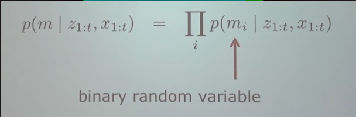
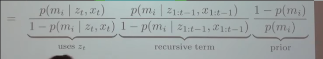
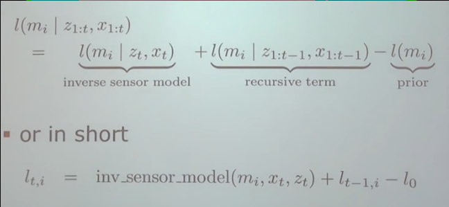

# SLAM Proj

## Cell values

**0** - Empty  
**0.5** - No knowledge (Init to this)  
**1** - Occupied  

## Assumptions

1. World n é rearranged
2. Uma cell ser preenchida n depende de vizinhas são preenchidas - Cells are **independant** of each other

## Probability Distribution of map

`p(m) = \prod_{i}{p(m_i)}`  
Probabilidade de o mapa inteiro estar no estado q dá predict:

### Example

Mapa com probabilidade:  
| 0.9 | 0.5 |  
| 0.8 | 0.1 |  
Qual a probabilidade de o map estar neste estado:  
| X | - |  
| X | - |  
0.9 \* (1 - 0.5) \* (1 - 0.8) \* (1 - 0.1)

## Hit probabilities

P(o | S) = Probability that cell o is occupied, given that robot sees sensor reading S
P(S | o) = Probability that sub sees sensor reading S, given that the cell is occupied

### Bayes theorem

P(o | S) = (P(S|o) \* P(o)) / P(S)

#### What we want

1. odds(o|S_2 ∧ S_1) - New value of cell in map after sonar reading S_2

#### What we know

2. odds(o|S_1) - Old value of a cell in the map (before reading S_2)
3. P(S_i|o) - Probabilities that a certain obstacle causes the sonar reading $S_i$

## Mapping with known poses

1. Estimar o mapa com info do sensor  

2. Eventualmente evolui para  

3. Que pode ser estimado com logs (mais eficiente)  

