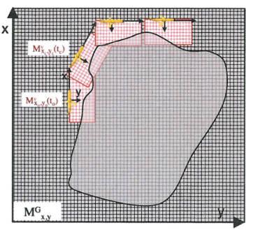
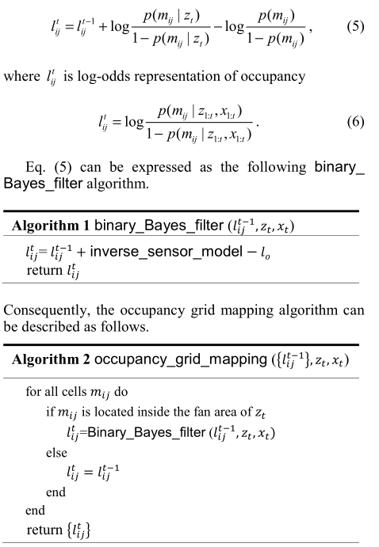
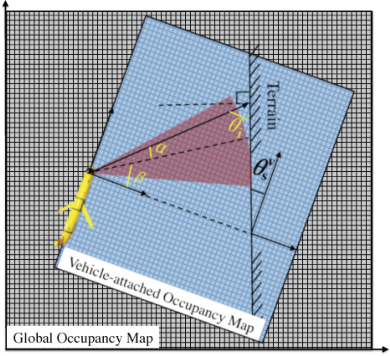
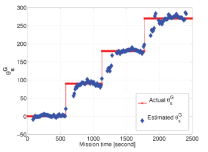

# Notinhas do Irão

## Occupancy maps

- **Global occupancy map (GOM)** - estacionário;
- **Vehicle-attached occupancy map (BOM)** - dinámico, centrado no centro de
  buoyancy do veículo. Move-se e roda com o veículo;
- Probabilidade de célula estar ocupada varia entre 0 (não ocupado) e 1
  (ocupado). **0.5** é considerado unknown (**valor inicializado**).

### Grid mapping algorithm

## Dynamic inverse-sonar model

- **Source level (SL)** - cálculado com base no transducer;
- **Directivity index (DI)** - varia com o ângulo dos raios;
- **Transmission loss (TL)** - causado pelo aumento da _ensonified area ovar the
  range_;
- **Attenuation loss (AL)** - energia dissipada para o meio durante a
  propagação;
- **Target strength (TS)** - energia refletida do target para nós (a que não
  absorvida/defletida para outras direções);

- O _forward looking angle_ cria **bias** (_arc-shapes_);

## Inverting sonar model

