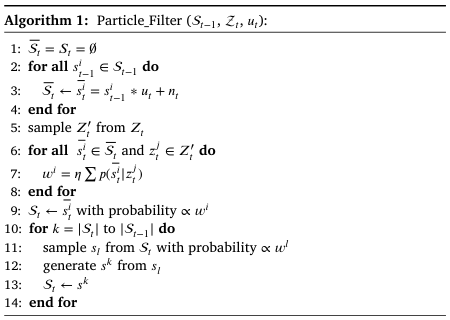
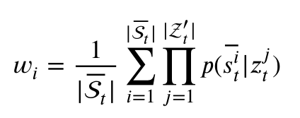

# Position

## Funcao de find

- find(p, R):
  - dá o conjunto de pontos no mapa em que dist(p, ponto_no_mapa) < R
  - vem organizado do mais perto para o mais longe
- s -- state (pose) = shift(x, y, z) + rotation(omega, theta, gamma)

## Belief

- $bel(s_t)$ -- belief about state of the robot
  - = $p(s_t | s_{t-1}, z_t, u_t)$
- $u_t$ -- displacement de $s_{t-1}$ para $s_{t}$ registado pelos sensores
  proprioceptive:
  - aplicar $u_t$ em $s_{t-1}$ da uma prediction do $s_t$ ($s'_t$)
  - $s'_t = s_{t-1} * u_t$
- $z_t$ -- info dos sensors do robot (sonar no nosso caso)
  - $Z_t$ - conjunto de pontos dados pelos sensores do robot

## Particle filter

- Conjunto $S_t$ de hypoteses para $s_t$ (aka particles)
- Cada $s_t$ está associado a uma probabilidade
- A acumulação de particulas numa regiao indica a posicao do robot no ambiente

### Analise algorithm

- Inputs:
  - Particle filter anterior -- $S_{t-1}$
  - Pontos dados pelos sensores -- $Z_t$
  - Transformação -- $u_t$
- $S'_t$ = $S_{t-1} * u_t + n_t$
  - $n_t$ é o noise
- Noise, $n_t$, segue uma distribuicao normal $N(0, o^2_u)$
  - $o^2_u$ é a variancia da odometria
  - 2 wheeled robots têm variancia baixa, mas debaixo de agua deve ser bastante
    mais alta
- Fazer sample de $Z_t$, $Z'_t$
  - escolhem random set de pontos de tamanho $N$, tal que $N$ está entre 20 e 50
- Initial belief:
  - Quando sabemos pos inicial (tracking) começamos com a belief toda nessa pros
  - Quando nao sabemos, fazemos distribuicao normal

### Parte das perceptions

- Para cada elemento de $S'_t$, calcula-mos o weight, $w_i$
  - Isto corresponde à probabilidade de cada $s'^i_t$ dadas as perceptions
    $Z'_t$

